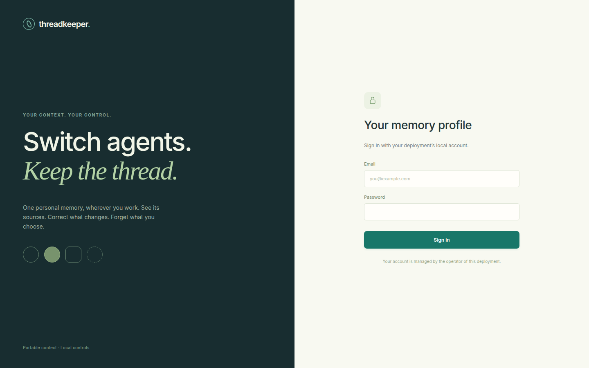
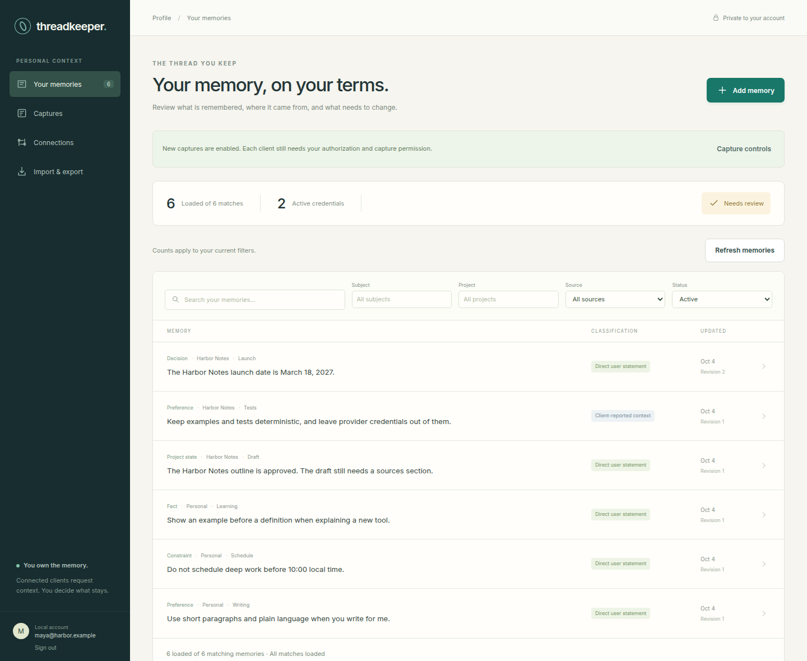
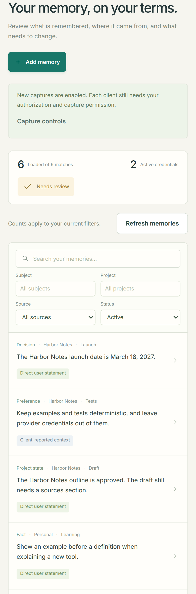
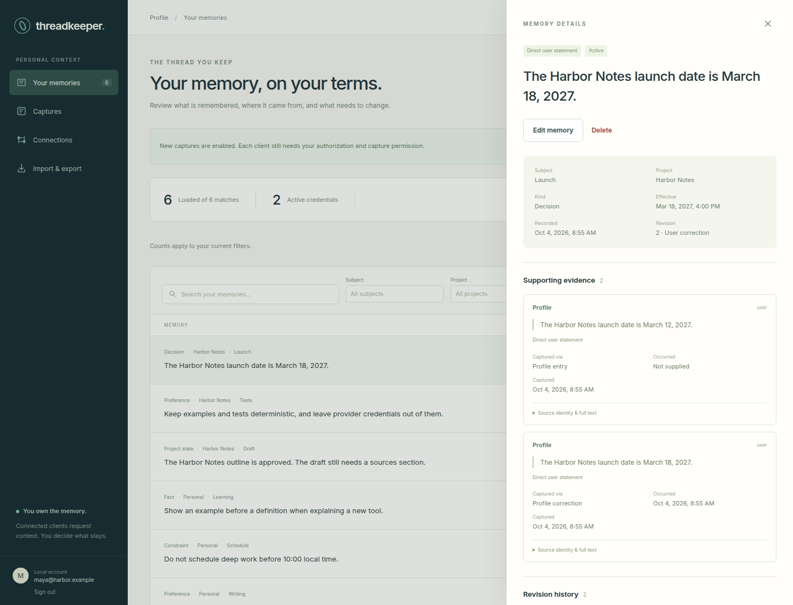
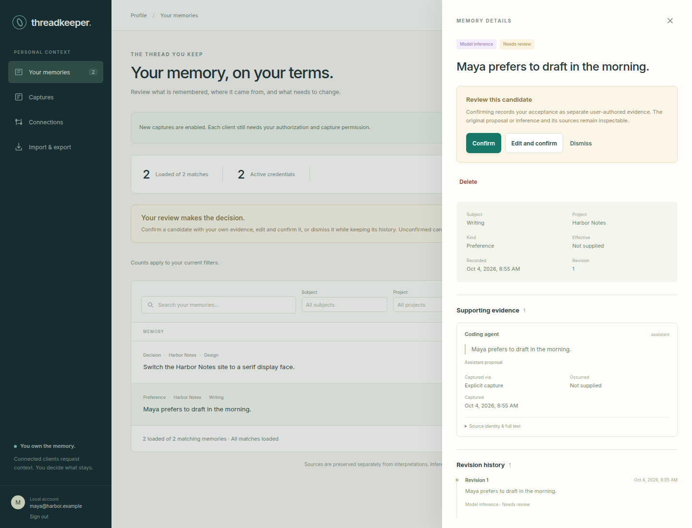
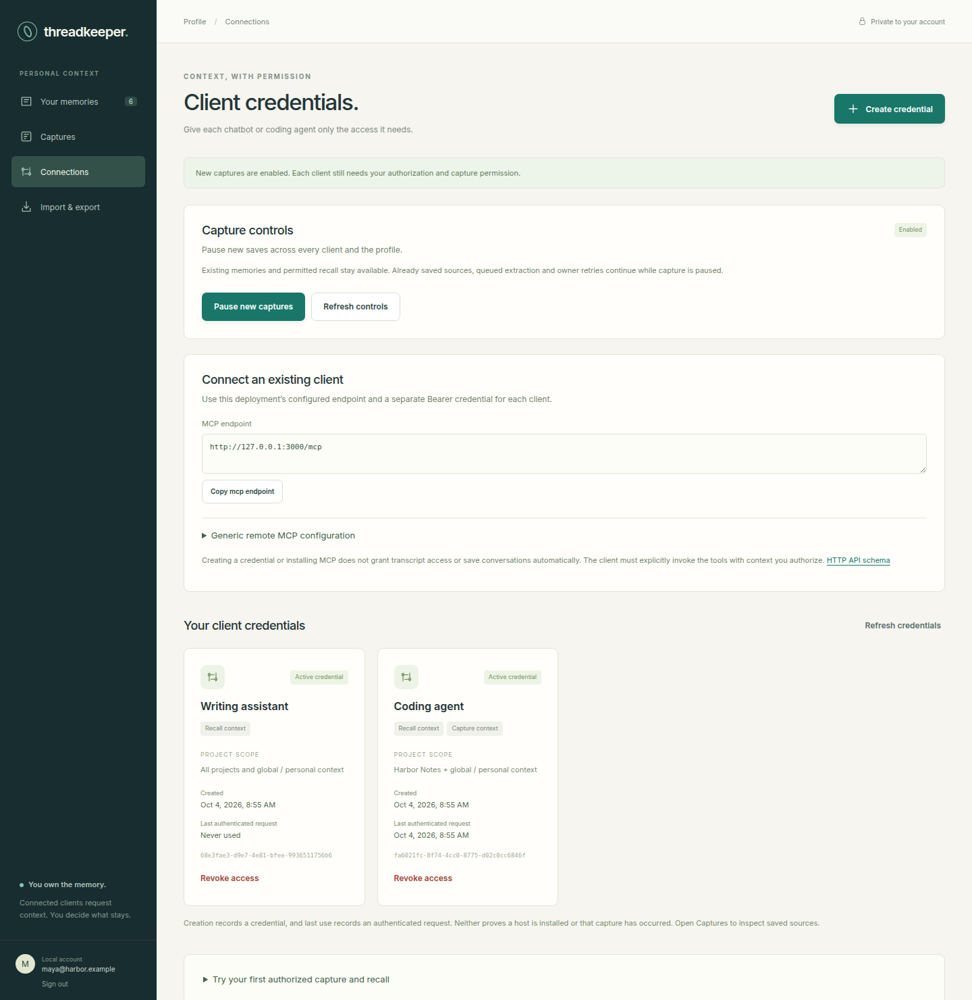
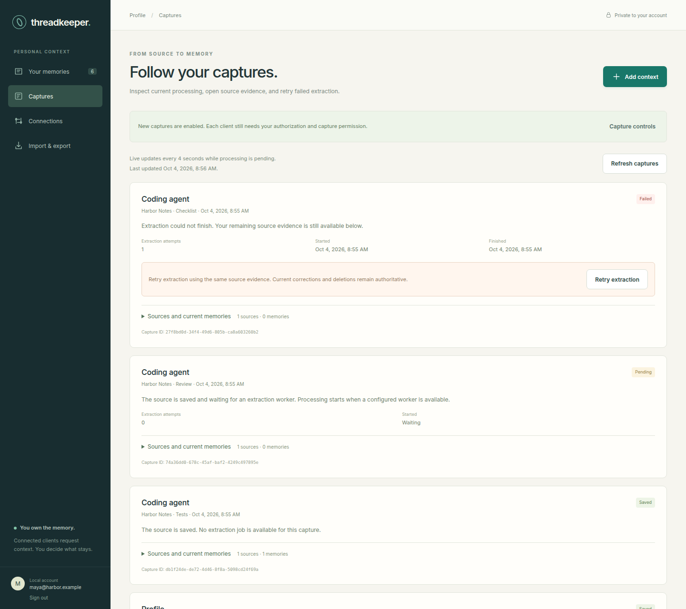
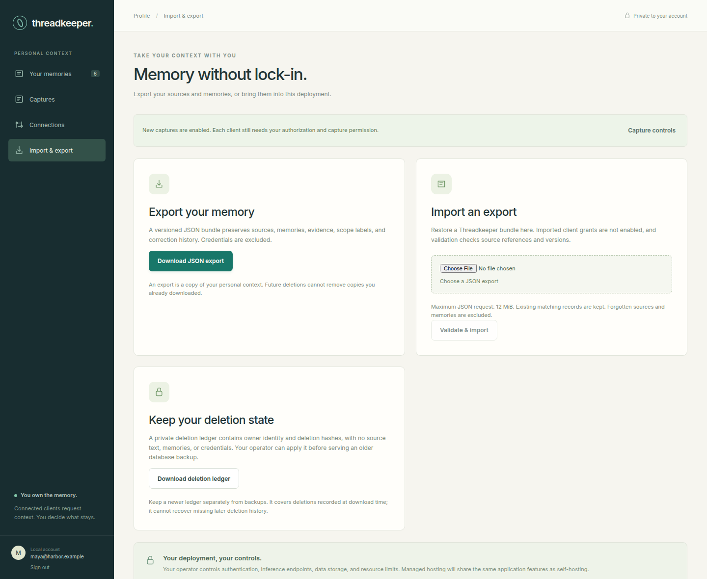

# Threadkeeper

**Switch agents. Keep the thread.**

Threadkeeper is a personal memory for the chatbots and coding agents you already use. You keep one profile of what should be remembered. Each client recalls that context when you allow it, and you can see where every memory came from.

You correct a record yourself. You decide which proposals to keep. You forget what you no longer want stored. Threadkeeper’s job is that shared memory: the profile, the sources, and the connection to the clients you already use.

The pictures below are a synthetic sample profile. They show the product with example writing preferences, a project called Harbor Notes, and two client credentials.



## Your memory, on your terms

Open the profile and read what is currently remembered. Search it, and narrow it by subject, project, source, or status. Each row shows the kind of memory, its subject and project, and whether you stated it or a client reported it.





Open a memory to see the statement, the source text, and the revision history. A correction becomes the current record immediately. The earlier wording stays attached as evidence, so you can see what changed.



### Review before a guess becomes memory

A model can propose a memory from something a client saved. That proposal waits in **Needs review**. It stays out of normal recall until you confirm it, edit it and confirm it, or dismiss it. Confirming writes your own acceptance beside the original proposal. Dismissing keeps the history and leaves the proposal out of normal recall.



### A credential for each client

Create a separate credential for each chatbot or coding agent. Give it recall, and capture only when that client should be allowed to save context. Limit it to the projects you choose. Pause new captures for every client at once, or revoke one credential when you are done with it. The client saves and recalls context when it calls Threadkeeper with material you authorize.



### Follow a capture

Captures shows what happened to context after it was saved. A direct memory is saved with its source. Context sent for extraction waits for the worker, and a failure stays visible so you can retry it. The source remains available either way.



### Take it with you

Download a versioned export of your sources, memories, evidence, and corrections. Credentials stay behind. Import that export into another Threadkeeper deployment. A separate deletion ledger lets an operator keep forgotten context out of an older database backup.



## Connect a client

1. Sign in and open **Connections**.
2. Create a credential for one client. Copy the token when it is shown. It is not shown again.
3. Copy the MCP endpoint and the connection example. The local endpoint looks like `http://127.0.0.1:3000/mcp`.
4. Put that endpoint and bearer token in the client’s remote MCP settings. The client needs Streamable HTTP and an Authorization header.
5. Tell the client to recall context that would change an answer, and to save only durable facts, preferences, decisions, and corrections you want kept.

Two clients can share what you have authorized without sharing their transcripts with each other. One can save a deadline and a writing preference. The other can recall both. After you correct the deadline and forget the preference, the next recall follows the profile.

Host-specific setup, including Codex, and the capture and recall tools are in the [client contract](docs/CLIENTS.md).

## Run Threadkeeper

Threadkeeper runs on your own machine. You choose the database, the model endpoint, and the account. There is no required Threadkeeper account.

Docker and Compose 2.24.4 or newer are the straightforward way to run the profile, API, worker, and PostgreSQL together.

```sh
cp .env.example .env
```

In your private `.env`, set `POSTGRES_PASSWORD`, `BOOTSTRAP_EMAIL`, and a `BOOTSTRAP_PASSWORD` of at least 12 characters. Use a URL-safe database password for Compose. For the included worker preset, set `NEBIUS_API_KEY` in that same file. Keep `.env` private.

```sh
docker compose --env-file .env -f deploy/compose.yaml up --build
```

Open `http://localhost:3000` and sign in as the account you configured. The API serves the profile and applies database migrations before it listens. PostgreSQL data stays in a named volume, and the published ports stay on localhost. Changing the bootstrap password later does not change an account that already exists.

Search works without an embedding service. Optional semantic recall, using an embedding endpoint you configure, is described in [retrieval setup](docs/RETRIEVAL.md). Backup, import rules, and restore are in [portability and operations](docs/PORTABILITY.md).

To click through the profile without installing PostgreSQL, build it and start the disposable demo:

```sh
pnpm install --frozen-lockfile
pnpm build
pnpm dev:demo
```

Open `http://127.0.0.1:3000` and sign in with `demo@example.invalid` / `threadkeeper-demo-password`. That demo uses a temporary local database, performs no model inference, and drops its data when you stop it. Use the Compose setup when you want the profile to keep your data.

Running the API and worker yourself, against a PostgreSQL database you already have, is covered in the [development guide](docs/DEVELOPMENT.md).

## How a memory is kept

Every memory points at source text. Your own statement, a client report, an assistant proposal, and a model inference stay labeled. Acceptance is an explicit action in the profile. An edit is authoritative as soon as you save it.

Forgetting shows you the memories, sources, history, and extraction jobs that will be removed. Confirming checks that list again. Removal covers the connected source events and the memories drawn from them, including history. Save separate facts as separate notes when you want to forget one without the others. A copy already delivered to a client, or an export you already downloaded, remains that copy. Threadkeeper can remove it from the current deployment and from future recall.

The worker turns saved source text into proposed memories through an OpenAI-compatible endpoint you configure. The preset model is `nvidia/Nemotron-3_5-Lightning` at `https://api.tokenfactory.nebius.com/v1/`. You can point the same application at a server you run yourself. Proposals still wait for your review.

## This repository

Threadkeeper is an early private build. The intended public address is `threadkeep.si`. This repository has not been published or deployed there, and the open-source license is still to be chosen. Use synthetic examples in demos and keep private history and credentials out of the project.

People changing the software should start with the [development guide](docs/DEVELOPMENT.md).
